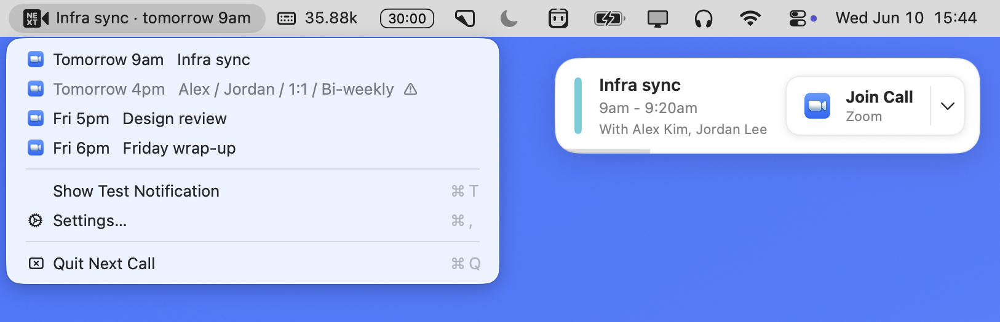

# Next Call

A macOS menu bar app that shows a notification 1 minute before your next video call, with a one-click Join button. Never be late because the call link was buried in some calendar tab.

<p align="center">
  
</p>

## Install

```bash
brew tap vvo/next-call https://github.com/vvo/next-call
brew install --cask vvo/next-call/next-call
```

Or build from source, no Xcode needed:

```bash
git clone https://github.com/vvo/next-call && cd next-call
./build.sh
open "Next Call.app"
```

## Features

- Fires 1 minute before every video call, top right of your screen, with who's on the invite
- One click to join. Opens the Zoom or Teams app directly when installed, the browser otherwise
- Detects Zoom, Google Meet, Microsoft Teams and Webex links
- Auto dismisses after 30 seconds. Hovering pauses the countdown
- Menu bar shows your next call with a countdown, click for the rest of the week
- Only counts calls you answered yes or maybe to
- Flags calls where everyone else declined, like a 1:1 where the other person said no
- Remind me at start time, copy the call link, pick your notification sound
- Choose which calendars to watch
- Local only. Reads your Apple Calendar (EventKit). No account, no server. The only network call is a version check against GitHub releases
- Tells you in the menu when a new version is available
- Start at login

## Permissions

The app asks for Calendar access on first launch. That's the only permission it needs. If you missed the prompt: System Settings → Privacy & Security → Calendars.

Google and Outlook calendars work too, as long as they show up in the macOS Calendar app.

## Uninstall

```bash
brew uninstall next-call
```
